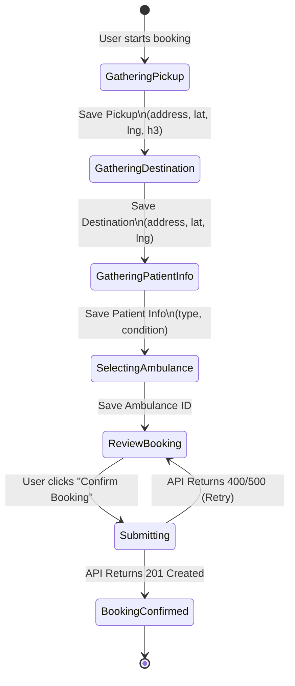
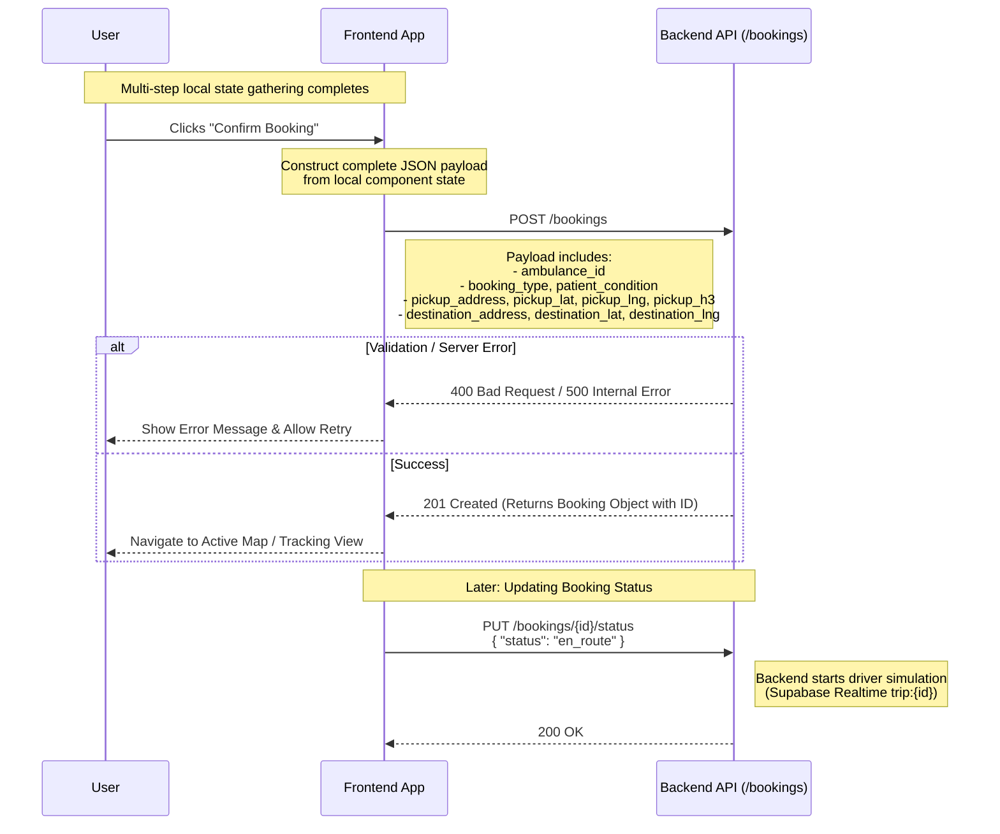

# Booking Flow

## Overview
The Booking API is designed around a **single-submission model**. The backend does not store partial or incomplete bookings. The frontend application is responsible for gathering all required booking details locally across multiple UI steps before submitting a complete payload to the `POST /bookings` endpoint.

### 1. Local State Accumulation (UI Flow)
The frontend should implement a state machine or multi-step wizard. The final API request cannot be made until the user reaches the `ReviewBooking` state and all data points are present in the local state.



### 2. API Submission & Lifecycle
Once the local state is fully populated, the frontend triggers the API submission. The sequence below outlines the final creation step and how to transition the booking into the active simulation phase.



### 3. Required Payload Structure Reference
To successfully transition from the `Submitting` state to `BookingConfirmed`, the `POST /bookings` payload must match this exact schema:

```json
{
  "ambulance_id": "uuid-string",
  "booking_type": "medis | sosial | jenazah | darurat",
  "patient_condition": "String description of condition",
  "pickup_address": "String address",
  "pickup_lat": -6.200000,
  "pickup_lng": 106.816666,
  "pickup_h3": "876526b33ffffff",
  "destination_address": "String address",
  "destination_lat": -6.210000,
  "destination_lng": 106.820000
}
```
*(Note: Do not send the `user_id` in the body; the backend resolves this automatically from the JWT payload).*
