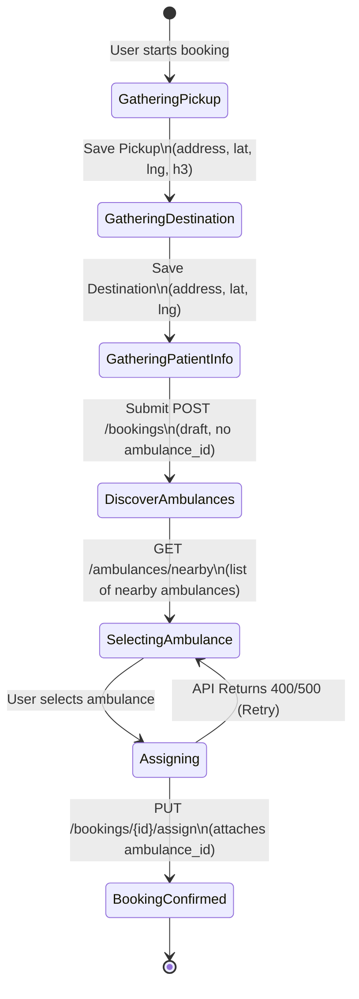
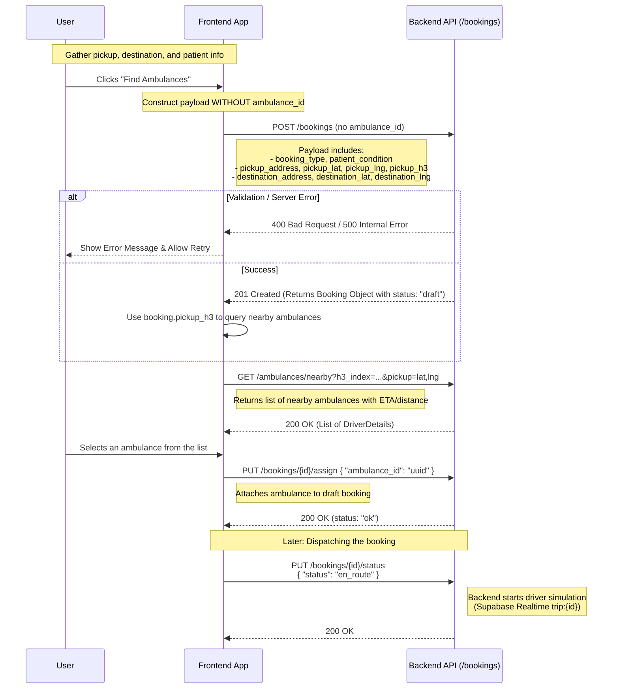

# Booking Flow

## Overview
The Booking API uses a **two-step submission model**:
1. **Step 1 (Save Condition):** Submit patient info and location to create a `draft` booking (no ambulance assigned yet).
2. **Step 2 (Assign Ambulance):** After selecting an ambulance from the nearby list, call the `/assign` endpoint to attach it and transition the booking to `confirmed`.

The backend persists the draft booking immediately so the user's data is never lost — even if they refresh, close the app, or switch devices.

### 1. Local State Accumulation (UI Flow)
The frontend should implement a state machine or multi-step wizard. The backend endpoints are called at the appropriate steps rather than in a single final submission.


```mermaid
stateDiagram-v2
    [*] --> GatheringPickup : User starts booking
    
    GatheringPickup --> GatheringDestination : Save Pickup\n(address, lat, lng, h3)
    GatheringDestination --> GatheringPatientInfo : Save Destination\n(address, lat, lng)
    GatheringPatientInfo --> DiscoverAmbulances : Submit POST /bookings\n(draft, no ambulance_id)
    
    DiscoverAmbulances --> SelectingAmbulance : GET /ambulances/nearby\n(list of nearby ambulances)
    SelectingAmbulance --> Assigning : User selects ambulance
    
    Assigning --> BookingConfirmed : PUT /bookings/{id}/assign\n(attaches ambulance_id)
    Assigning --> SelectingAmbulance : API Returns 400/500 (Retry)
    
    BookingConfirmed --> [*]
```

### 2. API Submission & Lifecycle


```mermaid
sequenceDiagram
    participant U as User
    participant F as Frontend App
    participant B as Backend API (/bookings)
    
    Note over U, F: Gather pickup, destination, and patient info
    
    U->>F: Clicks "Find Ambulances"
    Note over F: Construct payload WITHOUT ambulance_id
    
    F->>B: POST /bookings (no ambulance_id)
    Note right of F: Payload includes:<br/>- booking_type, patient_condition<br/>- pickup_address, pickup_lat, pickup_lng, pickup_h3<br/>- destination_address, destination_lat, destination_lng
    
    alt Validation / Server Error
        B-->>F: 400 Bad Request / 500 Internal Error
        F-->>U: Show Error Message & Allow Retry
    else Success
        B-->>F: 201 Created (Returns Booking Object with status: "draft")
        F->>F: Use booking.pickup_h3 to query nearby ambulances
    end
    
    F->>B: GET /ambulances/nearby?h3_index=...&pickup=lat,lng
    Note right of F: Returns list of nearby ambulances with ETA/distance
    B-->>F: 200 OK (List of DriverDetails)
    
    U->>F: Selects an ambulance from the list
    F->>B: PUT /bookings/{id}/assign { "ambulance_id": "uuid" }
    Note right of F: Attaches ambulance to draft booking
    B-->>F: 200 OK (status: "ok")
    
    Note over F, B: Later: Dispatching the booking
    F->>B: PUT /bookings/{id}/status <br/>{ "status": "en_route" }
    Note right of B: Backend starts driver simulation<br/>(Supabase Realtime trip:{id})
    B-->>F: 200 OK
```

### 3. Required Payload Structure Reference

**Step 1 — Create Draft Booking (`POST /bookings`):**

```json
{
  "booking_type": "medis | sosial | jenazah | darurat",
  "patient_condition": "String description of condition",
  "pickup_address": "String address",
  "pickup_lat": -6.200000,
  "pickup_lng": 106.816666,
  "pickup_h3": "876526b33ffffff",
  "destination_address": "String address",
  "destination_lat": -6.210000,
  "destination_lng": 106.820000
}
```
*(Note: `ambulance_id` is **optional**. If omitted, the backend creates a `draft` booking. Do not send `user_id`; it is resolved from the JWT payload).*

**Step 2 — Assign Ambulance (`PUT /bookings/{id}/assign`):**

```json
{
  "ambulance_id": "uuid-string"
}
```
*(Note: Only works for bookings in `draft` status. Transitions the booking to `confirmed`).*
