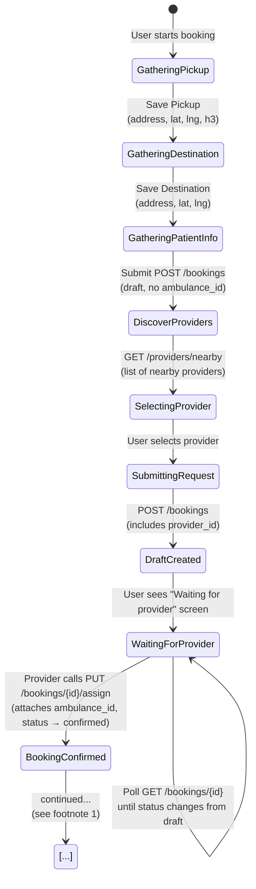
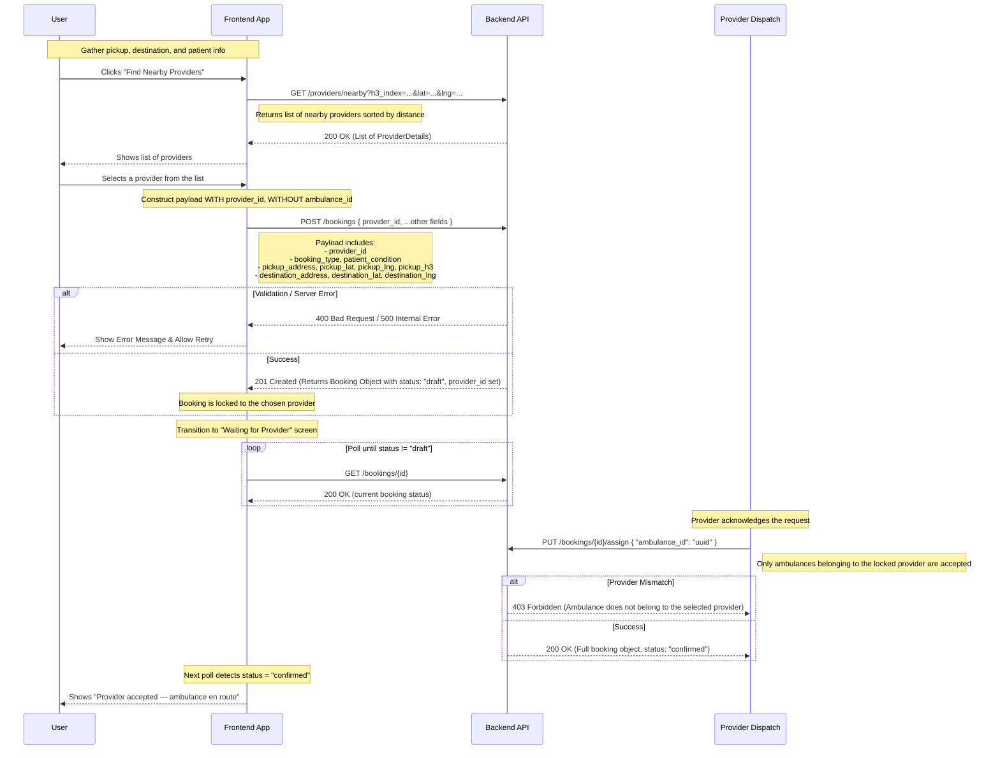

# Booking Flow

> All endpoints require `Authorization: Bearer <JWT>` header. User identity is derived from the JWT payload.

## Overview
The Booking API uses a **provider-directed dispatch model**:
1. **Step 1 (User Request):** The user selects a nearby provider (`GET /providers/nearby`), then submits their booking request with `provider_id` to create a `draft` booking locked to that provider.
2. **Step 2 (Provider Assignment):** The chosen provider's dispatch system sees the draft request and calls `PUT /bookings/{id}/assign` with an `ambulance_id` to accept and confirm it. Only ambulances belonging to the locked provider can be assigned — other providers cannot interfere.

This ensures the user has full control over which provider they contact, and providers manage their own fleet assignments in a directed manner rather than competing for requests.

### 1. Local State Accumulation (UI Flow)
The frontend should implement a state machine or multi-step wizard. The backend endpoints are called at the appropriate steps rather than in a single final submission.


```mermaid
stateDiagram-v2
    [*] --> GatheringPickup : User starts booking
    
    GatheringPickup --> GatheringDestination : Save Pickup<br>(address, lat, lng, h3)
    GatheringDestination --> GatheringPatientInfo : Save Destination<br>(address, lat, lng)
    GatheringPatientInfo --> DiscoverProviders : Submit POST /bookings<br>(draft, no ambulance_id)
    
    DiscoverProviders --> SelectingProvider : GET /providers/nearby<br>(list of nearby providers)
    SelectingProvider --> SubmittingRequest : User selects provider
    
    SubmittingRequest --> DraftCreated : POST /bookings<br>(includes provider_id)
    
    DraftCreated --> WaitingForProvider : User sees "Waiting for provider" screen
    WaitingForProvider --> BookingConfirmed : Provider calls PUT /bookings/{id}/assign<br>(attaches ambulance_id, status → confirmed)
    WaitingForProvider --> WaitingForProvider : Poll GET /bookings/{id}<br>until status changes from draft
    
    BookingConfirmed --> [...] : continued...<br>(see footnote 1)
```

> **Footnote 1:** After confirmation the booking progresses through `en_route` → `arrived` → `to_hospital` → `completed`. Track live status via `GET /bookings/{id}`.

### 2. API Submission & Lifecycle


```mermaid
sequenceDiagram
    participant U as User
    participant F as Frontend App
    participant B as Backend API
    participant P as Provider Dispatch
    
    Note over U, F: Gather pickup, destination, and patient info
    
    U->>F: Clicks "Find Nearby Providers"
    F->>B: GET /providers/nearby?h3_index=...&lat=...&lng=...
    Note right of F: Returns list of nearby providers sorted by distance
    B-->>F: 200 OK (List of ProviderDetails)
    F-->>U: Shows list of providers
    
    U->>F: Selects a provider from the list
    Note over F: Construct payload WITH provider_id, WITHOUT ambulance_id
    
    F->>B: POST /bookings { provider_id, ...other fields }
    Note right of F: Payload includes:<br/>- provider_id<br/>- booking_type, patient_condition<br/>- pickup_address, pickup_lat, pickup_lng, pickup_h3<br/>- destination_address, destination_lat, destination_lng
    
    alt Validation / Server Error
        B-->>F: 400 Bad Request / 500 Internal Error
        F-->>U: Show Error Message & Allow Retry
    else Success
        B-->>F: 201 Created (Returns Booking Object with status: "draft", provider_id set)
        Note over F: Booking is locked to the chosen provider
    end
    
    Note over F: Transition to "Waiting for Provider" screen
    
    loop Poll until status != "draft"
        F->>B: GET /bookings/{id}
        B-->>F: 200 OK (current booking status)
    end
    
    Note over P: Provider acknowledges the request
    P->>B: PUT /bookings/{id}/assign { "ambulance_id": "uuid" }
    Note right of P: Only ambulances belonging to the locked provider are accepted
    alt Provider Mismatch
        B-->>P: 403 Forbidden (Ambulance does not belong to the selected provider)
    else Success
        B-->>P: 200 OK (Full booking object, status: "confirmed")
    end
    
    Note over F: Next poll detects status = "confirmed"
    F-->>U: Shows "Provider accepted — ambulance en route"
```

### 3. Required Payload Structure Reference

**Step 1 — Create Draft Booking (`POST /bookings`):**

Values for `booking_type`: `"medis"`, `"sosial"`, `"jenazah"`, `"darurat"`.

Validation bounds: latitude ∈ `[-90, 90]`, longitude ∈ `[-180, 180]`. Invalid values return 400.

```json
{
  "provider_id": "uuid-string",
  "booking_type": "medis",
  "patient_condition": "String description of condition",
  "pickup_address": "String address",
  "pickup_lat": -6.200000,
  "pickup_lng": 106.816666,
  "pickup_h3": "876526b33ffffff",
  "destination_address": "String address",
  "destination_lat": -6.210000,
  "destination_lng": 106.820000
}
```
*(Note: Pass `provider_id` to lock the draft booking to a specific healthcare facility. Omit `ambulance_id` to create a `draft` booking. If `ambulance_id` is also provided, the booking is created in `confirmed` status. Do not send `user_id`; it is resolved from the JWT payload).*

**Step 2 — Assign Ambulance (Provider-only, `PUT /bookings/{id}/assign`):**

```json
{
  "ambulance_id": "uuid-string"
}
```
*(Note: This endpoint is intended to be called by the **provider's dispatch system**. The assigned ambulance must belong to the provider the booking is locked to — otherwise the request is rejected with `403 Forbidden`).*

**Response:**

```json
{
  "id": "uuid-string",
  "status": "confirmed",
  "ambulance_id": "uuid-string",
  "provider_id": "uuid-string",
  "booking_type": "medis",
  "patient_condition": "String",
  "pickup_address": "String",
  "pickup_lat": -6.2,
  "pickup_lng": 106.8,
  "pickup_h3": "876526b33ffffff",
  "destination_address": "String",
  "destination_lat": -6.21,
  "destination_lng": 106.82,
  "user_id": "uuid-string",
  "created_at": "ISO-8601 timestamp"
}
```

### 4. Booking Statuses

| Status | Description |
|--------|-------------|
| `draft` | Initial state, no ambulance assigned, locked to a provider |
| `confirmed` | Ambulance assigned, awaiting dispatch |
| `en_route` | Ambulance en route to pickup |
| `arrived` | Ambulance arrived at pickup location |
| `to_hospital` | Ambulance transporting patient to hospital |
| `completed` | Trip finished |
| `cancelled` | Booking cancelled |

**Expected transition flow:** `draft` → `confirmed` → `en_route` → `arrived` → `to_hospital` → `completed`. The backend does not enforce strict ordering, but deviating from this flow may produce unexpected behaviour.

### 5. Error Responses

All endpoints return errors in this shape:

```json
{
  "error": "Human-readable error message",
  "details": {}
}
```

Common HTTP statuses: `400` (validation), `403` (unauthorized), `404` (not found), `500` (internal error).

### 6. Provider Discovery

**`GET /providers/nearby?h3_index=...&lat=...&lng=...`**

Returns up to 50 providers within an expanding H3 ring search (up to ~60 km radius), ordered by distance ascending. Use `GET /providers/search?q=...` for text-based provider search.
