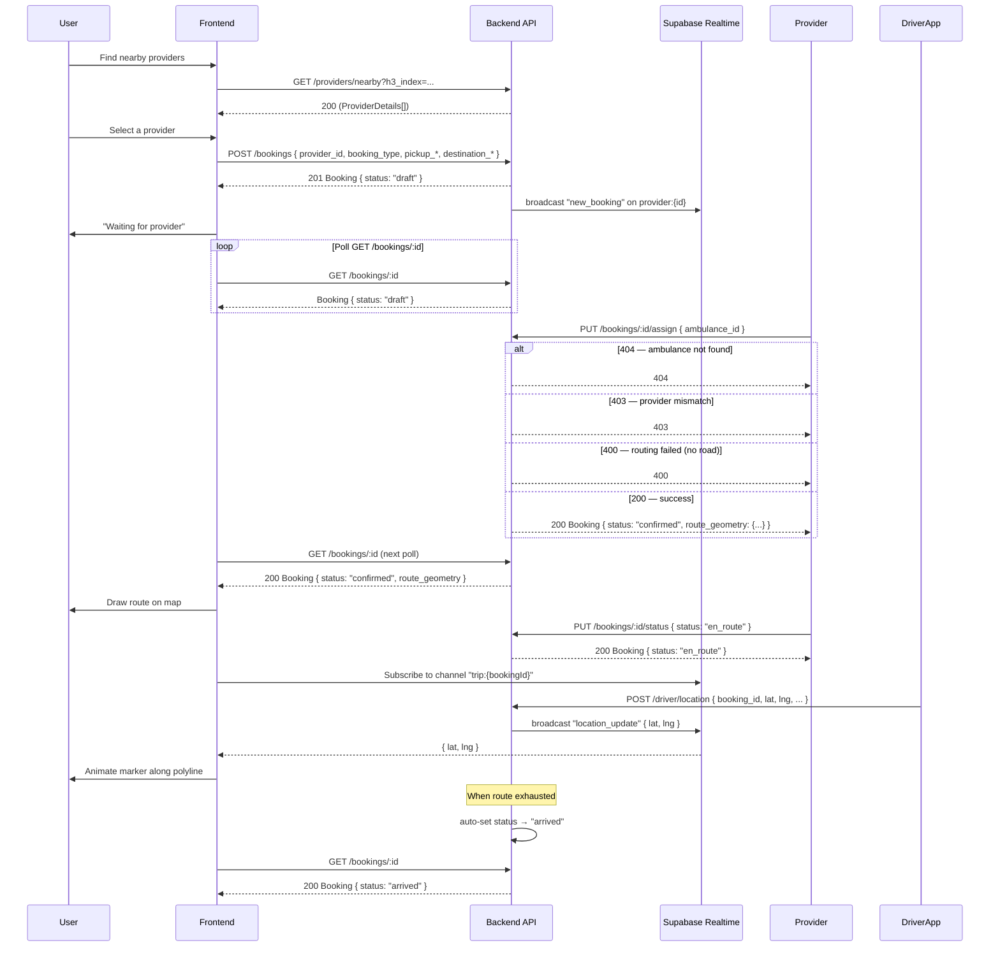

# Booking Flow — Frontend Integration Guide

## 1. Overview
The Booking API uses a **provider-directed dispatch model**.
- **Two-step flow:** User requests booking (status `draft`) → Provider assigns ambulance → `confirmed`.
- **One-step flow:** User provides `ambulance_id` during creation → `confirmed` immediately.
- **Key constraint:** `en_route` status can only be set by a provider or admin.

## 2. Authentication & Roles

### 2.1 Header format
`Authorization: Bearer <JWT>`

### 2.2 JWT Payload fields available to frontend
- `sub`: string → user_id (maps to `booking.user_id`)
- `role`: string | undefined → "provider" | "admin" | undefined
- `app_metadata.role`: string
- `app_metadata.provider_id`: string → present for provider accounts

### 2.3 Role checks
- **Is Provider:** `payload.role === "provider" || payload.app_metadata?.role === "provider"`
- **Is Driver:** `payload.role === "driver" || payload.app_metadata?.role === "driver"`
- **Is Admin:** `payload.role === "admin" || payload.app_metadata?.role === "admin"`

### 2.4 Unauthenticated endpoints (no token needed)
- `GET /providers/nearby`
- `GET /providers/search`
- `GET /hospitals/nearby`
- `GET /hospitals/search`

## 3. API Reference

### 3.1 Provider Discovery
#### GET /providers/nearby — public, no rate limit
- **Query:** `h3_index` (required, H3-7), `lat` (optional), `lng` (optional)
- **Response:** `ProviderDetails[]` (includes `provider_type`, `distance`, `distance_value`)
- **Logic:** Expanding H3 rings, up to 50 results, sorted by `distance_value` (meters) ascending.

#### GET /providers/search?q=...&limit=... — public, no rate limit
- **Response:** `Provider[]`

#### GET /providers/:id/bookings — auth required (provider/admin only)
- **Query:** `status` (filter), `limit` (default 10), `offset` (default 0)
- **Response:** `Booking[]`
- **Notes:** Provider must match `:id` from JWT.

### 3.2 Booking CRUD
#### POST /bookings — auth, RL: 30/min
- **Body (required fields):**
  - `booking_type`: `"medis"` | `"sosial"` | `"jenazah"` | `"darurat"`
  - `patient_condition`: string
  - `pickup_address`: string
  - `pickup_lat`: number [-90, 90]
  - `pickup_lng`: number [-180, 180]
  - `pickup_h3`: string (H3 resolution 7, 15 hex chars, validated via h3-js)
  - `destination_address`: string
  - `destination_lat`: number [-90, 90]
  - `destination_lng`: number [-180, 180]
- **Body (optional fields):**
  - `provider_id`: uuid — locks draft booking to a provider
  - `ambulance_id`: uuid — if set, booking is created as `confirmed` (skips draft)
- **Validation errors:**
   - Latitude outside [-90,90] → `400` `details.pickup_lat._errors`
   - Longitude outside [-180,180] → `400` `details.pickup_lng._errors`
   - Invalid H3 index → `400` `details.pickup_h3._errors`
   - Invalid `booking_type` → `400` `details.booking_type._errors`
- **Notes:**
  - `user_id` is injected from JWT — do NOT send it.
  - `estimated_price` auto-calculated: `medis`=50k, `sosial`=0, `jenazah`=50k, `darurat`=100k.
  - If draft + `provider_id` set: backend broadcasts `new_booking` on `provider:{providerId}`.
- **Response:** 201 full `Booking` object.
- **Errors:** 400 (validation), 401 (missing/invalid token), 429 (rate limit), 500 (server error).

#### GET /bookings — auth, RL: 30/min
- **Query:** `limit`? (1—100), `offset`? (min 0)
- **Response:** 200 `Booking[]` (ordered `created_at DESC`, filtered by JWT `sub`).
- **Errors:** 401, 429.

#### GET /bookings/:id — auth, RL: 30/min
- **Path:** `id` (uuid)
- **Response:** 200 full `Booking` object.
- **Errors:** 401, 403 (not owner/provider/admin), 404 (not found), 429.

### 3.3 Assignment & Status
#### PUT /bookings/:id/assign — auth, RL: 30/min
- **Body:** `{ ambulance_id: uuid, driver_id?: uuid }`
- **Logic:**
    1. Status must be `draft`.
    2. Ambulance must exist and belong to the correct provider (if booking locked to provider).
    3. If `driver_id` is provided, pre-assigns the driver to the booking.
    4. Calculates `route_geometry` (Leg 1: amb-to-pickup, Leg 2: pickup-to-destination).
    5. Transitions to `confirmed`.
- **Response:** 200 `Booking` (with `route_geometry`).
- **Errors:** 400 (not draft), 403 (provider mismatch), 404 (ambulance not found), 400 (routing failed).

#### PUT /bookings/:id/status — auth, RL: 30/min
- **Body:** `{ status: BookingStatus }`
- **Constraint:** `en_route` requires `isProviderRole` or `isAdminRole` (403 for regular users).
- **Logic:** Validates transitions, primes simulation (if `en_route`), cleans up simulation (if `cancelled`).
- **Response:** 200 `Booking` object.

### 3.4 Driver API (Driver App)
#### POST /driver/location — auth, RL: 60/min
- **Body:** `{ booking_id: uuid, lat: number, lng: number, heading?: number, speed?: number }`
- **Logic:** Updates driver's live GPS location, persists to Redis cache (hot) and Supabase history (batch).

#### GET /driver/bookings/:id/track — auth, RL: 30/min
- **Response:** `{ location: DriverLocation | null }`
- **Logic:** Returns the latest GPS point for the driver assigned to this booking. Returns `null` if no ambulance is assigned yet or if the booking is not yet `en_route`.

#### GET /driver/assignments — auth, RL: 30/min
- **Response:** 200 `Booking[]` (all current assignments for the driver).

#### PUT /driver/status — auth, RL: 30/min
- **Body:** `{ online: boolean }`
- **Logic:** Sets driver's online/offline status.

## 4. Booking State Machine

### 4.1 Status Transitions (PUT /bookings/:id/status)
The diagram shows only `PUT /bookings/:id/status` transitions. `draft → confirmed` is done via `PUT /bookings/:id/assign` (see §4.2).

```
draft ───────────────────────────────────────────────────→ cancelled

confirmed ──→ en_route ──→ arrived ──→ to_hospital ──→ completed
  │              │            │  │             │
  │              │            │  └──→ completed │
  └── cancelled   └── cancelled  └──→ cancelled  └──→ cancelled
```

### 4.2 Assignment Transition
```
draft ──(PUT /bookings/:id/assign)──→ confirmed
```

### 4.3 Access Matrix (Status Endpoint)
| Current → New Status | User (owner) | Provider | Admin |
|---------------------|:------------:|:--------:|:-----:|
| draft → cancelled | ✓ | ✓ | ✓ |
| confirmed → en_route | ❌ | ✓ | ✓ |
| confirmed → cancelled | ✓ | ✓ | ✓ |
| en_route → arrived | ✓ | ✓ | ✓ |
| en_route → cancelled | ✓ | ✓ | ✓ |
| arrived → to_hospital | ✓ | ✓ | ✓ |
| arrived → completed | ✓ | ✓ | ✓ |
| arrived → cancelled | ✓ | ✓ | ✓ |
| to_hospital → completed | ✓ | ✓ | ✓ |
| to_hospital → cancelled | ✓ | ✓ | ✓ |

**Note:** `draft → confirmed` is performed via `PUT /bookings/:id/assign`, not the status endpoint. Any user who can access the booking (owner, provider, admin) may call assign.

## 5. Real-Time Integration

### 5.1 Trip Location Channel
- **Channel:** `trip:{bookingId}`
- **Event:** `location_update`
- **Payload:** `{ lat: number, lng: number }` (ephemeral broadcast, driven by driver app GPS updates)

```js
import { createClient } from "@supabase/supabase-js";

const supabase = createClient(SUPABASE_URL, SUPABASE_ANON_KEY);
const channel = supabase
  .channel(`trip:${bookingId}`)
  .on("broadcast", { event: "location_update" }, (msg) => {
    const { lat, lng } = msg.payload;
    animateAmbulanceMarker(lat, lng);
  })
  .subscribe();
// Clean up on unmount: supabase.removeChannel(channel)
```

### 5.2 Provider New Booking Channel
- **Channel:** `provider:{providerId}`
- **Event:** `new_booking`
- **Payload:** Full `Booking` object

### 5.3 Polling Strategy
Use polling as fallback when Realtime is unavailable.

| Booking status | Poll interval | Stop when |
|---------------|:------------:|:---------:|
| `draft` | 5–10s | Status changes away from `draft` |
| `confirmed` | 5–10s | Status changes away from `confirmed` |
| `en_route` | 3–5s | Status is `arrived`, `completed`, or `cancelled` |
| `arrived` / `to_hospital` | 10s | Status is `completed` or `cancelled` |
| `completed` / `cancelled` | Stop polling | — |


## 6. Error Handling

### 6.1 Standard Error
```json
{ "error": "Human-readable message", "details": {} }
```
- **Zod Validation Error (400):** `details` contains per-field errors: `details[field]._errors[0]`

### 6.2 HTTP Codes
- **400:** Validation or business rule (invalid status transition, not draft, routing failed)
- **401:** Missing/invalid `Authorization` header
- **403:** Permission denied (role mismatch)
- **404:** Resource not found
- **429:** Rate limit exceeded (30 req/min)

## 7. End-to-End Flow Sequence


```mermaid
sequenceDiagram
    participant U as User
    participant F as Frontend
    participant B as Backend API
    participant R as Supabase Realtime
    participant P as Provider

    U->>F: Find nearby providers
    F->>B: GET /providers/nearby?h3_index=...
    B-->>F: 200 (ProviderDetails[])

    U->>F: Select a provider
    F->>B: POST /bookings { provider_id, booking_type, pickup_*, destination_* }
    B-->>F: 201 Booking { status: "draft" }
    B->>R: broadcast "new_booking" on provider:{id}

    F->>U: "Waiting for provider"

    loop Poll GET /bookings/:id
        F->>B: GET /bookings/:id
        B-->>F: Booking { status: "draft" }
    end

    P->>B: PUT /bookings/:id/assign { ambulance_id }
    alt 404 — ambulance not found
        B-->>P: 404
    else 403 — provider mismatch
        B-->>P: 403
    else 400 — routing failed (no road)
        B-->>P: 400
    else 200 — success
        B-->>P: 200 Booking { status: "confirmed", route_geometry: {...} }
    end

    F->>B: GET /bookings/:id (next poll)
    B-->>F: 200 Booking { status: "confirmed", route_geometry }
    F->>U: Draw route on map

    P->>B: PUT /bookings/:id/status { status: "en_route" }
    B-->>P: 200 Booking { status: "en_route" }

    F->>R: Subscribe to channel "trip:{bookingId}"
    DriverApp->>B: POST /driver/location { booking_id, lat, lng, ... }
    B->>R: broadcast "location_update" { lat, lng }
    R-->>F: { lat, lng }
    F->>U: Animate marker along polyline

    Note over B: When route exhausted
    B->>B: auto-set status → "arrived"
    F->>B: GET /bookings/:id
    B-->>F: 200 Booking { status: "arrived" }
```

## 8. Map Integration — Route Geometry

### 8.1 Null guard
```js
if (!booking.route_geometry) return; // still in draft status
```

### 8.2 Shape
```json
{
  "total_distance_meters": 12450,
  "total_duration_seconds": 1800,
  "combined_viewport": {
    "low": { "lat": -6.3644, "lng": 106.8272 },
    "high": { "lat": -6.1754, "lng": 106.8286 }
  },
  "legs": [
    { "sequence": 1, "encoded_polyline": "}x|eFnp~iVq@o@u..." },
    { "sequence": 2, "encoded_polyline": "a~zdMvv_jV_Bc@s..." }
  ]
}
```

### 8.3 Decode polylines (Mapbox polyline6)
```js
import polyline from "@mapbox/polyline";

const allPoints = [];
for (const leg of booking.route_geometry.legs) {
  const points = polyline.decode(leg.encoded_polyline, 6);
  allPoints.push(...points);
}
// allPoints → [lat, lng][] for drawing on map
```

### 8.4 Fit map to combined viewport
```js
const vp = booking.route_geometry.combined_viewport;
map.fitBounds(
  [
    [vp.low.lng, vp.low.lat],
    [vp.high.lng, vp.high.lat],
  ],
  { padding: 50 },
);
```

## 9. TypeScript Interfaces Reference

```typescript
// ── Booking Status ──
type BookingStatus =
  | "draft" | "confirmed" | "en_route" | "arrived"
  | "to_hospital" | "completed" | "cancelled";

// ── Booking (full response shape) ──
interface Booking {
  id: string;
  status: BookingStatus;
  ambulance_id: string | null;
  provider_id: string | null;
  driver_id: string | null;
  booking_type: "medis" | "sosial" | "jenazah" | "darurat";
  patient_condition: string;
  pickup_address: string;
  pickup_lat: number;
  pickup_lng: number;
  pickup_h3: string;
  destination_address: string;
  destination_lat: number;
  destination_lng: number;
  user_id: string;
  estimated_price: number;
  route_geometry: RouteGeometry | null;
  created_at: string; // ISO-8601
}

// ── Route Geometry (present only when status ≥ confirmed) ──
interface RouteGeometry {
  total_distance_meters: number;
  total_duration_seconds: number;
  combined_viewport: {
    low: { lat: number; lng: number };
    high: { lat: number; lng: number };
  };
  legs: RouteLeg[];
}
interface RouteLeg {
  sequence: number;         // 1 = ambulance → pickup, 2 = pickup → destination
  encoded_polyline: string; // Mapbox polyline6
}

// ── Driver ──
interface Driver {
  id: string;
  name: string;
  online: boolean;
}

// ── Realtime Location Update ──
interface DriverLocation {
  booking_id: string;
  lat: number;
  lng: number;
  heading?: number;
  speed?: number;
}
```
